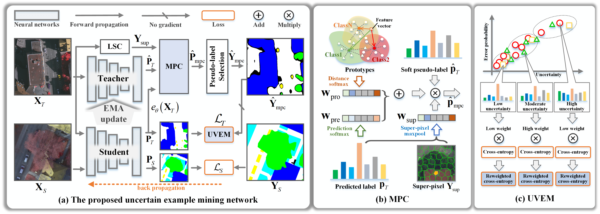

<h2 align="center">Uncertain Example Mining Network for Domain Adaptive Segmentation of Remote Sensing Images</h2>
<center><a href="https://scholar.google.com/citations?user=LXlWdyQAAAAJ&hl=zh-CN">paper</a></center>

<!-- [paper](https://ieeexplore.ieee.org/abstract/document/10666777) -->
<h5 align="center">by <a href="https://scholar.google.com/citations?user=LXlWdyQAAAAJ&hl=zh-CN">Wang Liu</a>, 
Puhong Duan, Zhuojun Xie, Xudong Kang, and Shutao Li</h5>
<div align=center></div>
<p align="center">Fig. 1 An overview of the proposed UemDA.</p>


## Getting Started

### Environment:
- conda create -n uemda python=3.8
- source activate uemda
- pip install torch==1.8.1+cu111 torchvision==0.9.1+cu111 torchaudio==0.8.1 -f https://download.pytorch.org/whl/torch_stable.html
- conda install pytorch-scatter -c pyg
- pip install ever-beta
- pip install -r requirement.txt
- pip install -e .

### Prepare datasets

- Download the raw datasets from <a href="https://www.isprs.org/education/benchmarks/UrbanSemLab/2d-sem-label-potsdam.aspx">here</a>.
- Run the preprocess script in ./convert_datasets/ to crop train, val, test sets:\
`python convert_datasets/convert_potsdam.py`\
`python convert_datasets/convert_vaihingen.py`
- The prepared data is formatted as follows: \
./data\
----&nbsp;IsprsDA\
&nbsp;&nbsp;&nbsp;&nbsp;&nbsp;----&nbsp;Potsdam\
&nbsp;&nbsp;&nbsp;&nbsp;&nbsp;&nbsp;&nbsp;&nbsp;&nbsp;&nbsp;----&nbsp;ann_dir\
&nbsp;&nbsp;&nbsp;&nbsp;&nbsp;&nbsp;&nbsp;&nbsp;&nbsp;&nbsp;----&nbsp;img_dir\
&nbsp;&nbsp;&nbsp;&nbsp;&nbsp;----&nbsp;Vaihingen\
&nbsp;&nbsp;&nbsp;&nbsp;&nbsp;&nbsp;&nbsp;&nbsp;&nbsp;&nbsp;----&nbsp;ann_dir\
&nbsp;&nbsp;&nbsp;&nbsp;&nbsp;&nbsp;&nbsp;&nbsp;&nbsp;&nbsp;----&nbsp;img_dir\
- Generate local regions by run \
`python tools/generate_superpixels.py`


### Train the UemDA
```bash 
bash runs/uemda/run_2potsdam.sh
```
```bash 
bash runs/uemda/run_2vaihingen.sh
```


### Evaluate the trained UemDA models.\
Download the pre-trained [<b>weights</b>](https://pan.baidu.com/s/1rWHSgRpSVPlLt5_bykHCOg?pwd=6th5) and logs.
#### 1. on Vaihingen (IRRG) -> Potsdam (IRRG) task
Run evaluating: `python tools/eval.py --config-path st.uemda.2potsdam --ckpt-path log/uemda/2potsdam/ssl/Potsdam_best.pth --test 1`
#### 2. on Potsdam (IRRG) -> Vaihingen (IRRG) task
Run evaluating: `python tools/eval.py --config-path st.uemda.2vaihingen --ckpt-path log/uemda/2vaihingen/ssl/Vaihingen_best.pth --test 1`


### Inference single file
```bash 
python tools/infer_single.py st.uemda.2potsdam log/uemda/ssl/Potsdam_best.pth [image-path] --save-dir [save-dir-path]
```

If this repository is helpful for you, please cite it in your work.

```commandline
@ARTICLE{10666777,
  author={Liu, Wang and Duan, Puhong and Xie, Zhuojun and Kang, Xudong and Li, Shutao},
  journal={IEEE Transactions on Geoscience and Remote Sensing}, 
  title={Uncertain Example Mining Network for Domain Adaptive Segmentation of Remote Sensing Images}, 
  year={2024},
  volume={},
  number={},
  pages={1-1},
  keywords={Noise measurement;Training;Image segmentation;Remote sensing;Accuracy;Adaptive systems;Sensors;Domain adaptation;remote sensing image segmentation;self-training;noise label correction},
  doi={10.1109/TGRS.2024.3443071}
}
```


